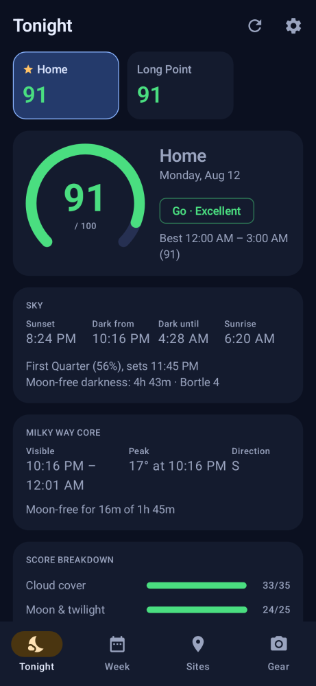
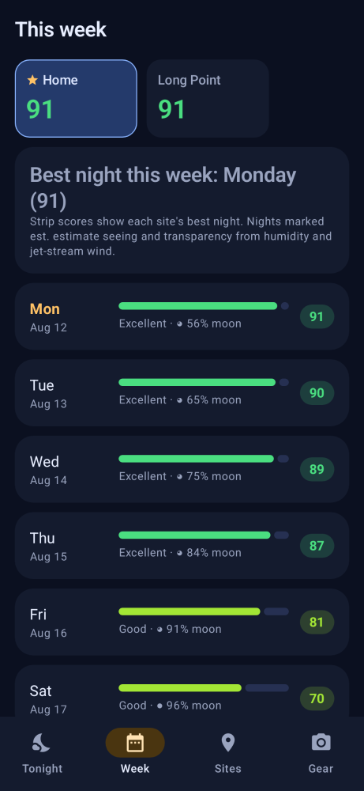
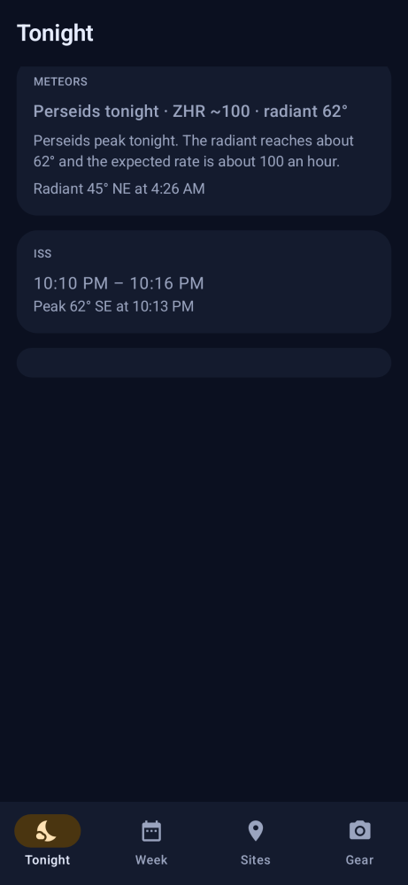
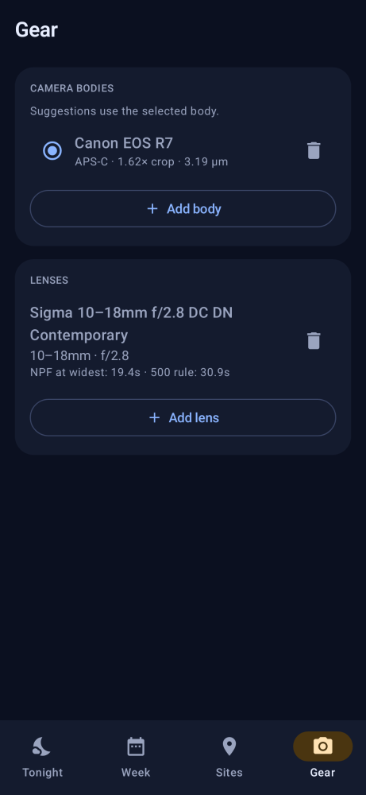

# NightBrief

NightBrief is a native Android app that answers one question before you pack the car: is tonight worth imaging?

It scores the night at each place you shoot from — clouds, Moon, darkness, transparency, wind, seeing, and sky brightness — and turns that into a go, maybe, or no-go. Tonight shows the score, the sky, and the Milky Way window. This week lines up the next few nights. The camera and lenses you own turn a target into an exposure. A morning notification carries the same answer, a home-screen widget shows the score, a Wear OS tile shows that score and the verdict, and a night at 85 or above can raise a Big Night alert. A shower worth watching, or an ISS pass in the dark window, shows up on Tonight as well.

The screens below are the app's Compose UI for a clear August 2024 night at a Bortle 4 site near Toronto, using the example Canon EOS R7 and Sigma 10–18mm kit.

| Tonight | This week |
| --- | --- |
|  |  |

| Perseids and an ISS pass | Gear |
| --- | --- |
|  |  |

The app is Kotlin, `minSdk` 26. `:app` is the Compose UI: tonight, a week outlook, a planner for one site and date, and a site list with an OpenStreetMap picker. Saved gear drives the exposure hints on those screens. Forecasts, ephemeris, scoring, and settings live in the libraries below.

## Modules

Dependencies point inward. A module may use the ones it lists, not the other way around.

| Module | Kind | Depends on | Role |
| --- | --- | --- | --- |
| `:core-astro` | JVM | — | Sun, Moon, and galactic-centre positions; night windows; annual meteor showers; SGP4 and ISS passes |
| `:core-weather` | JVM | — | Open-Meteo, 7Timer, NOAA SWPC Kp, and Celestrak ISS element clients, with forecast and TLE caches |
| `:core-sites` | JVM | — | Saved sites and Bortle lookup |
| `:core-gear` | JVM | — | Camera bodies, lenses, NPF / 500-rule exposure hints |
| `:core-score` | JVM | astro, weather, sites, gear | Night Score, tonight's plan, meteor and ISS outlooks, digest text, site comparison |
| `:data` | Android | score | `AppState` datastore and the process-wide `AppGraph` |
| `:work` | Android | data | Morning alarm, digest notification, forecast prefetch |
| `:app` | Android | work | Compose UI, home-screen widget, Wear data-layer publish |
| `:wear` | Android (watch) | data | Wear OS tile and watch screen for the primary score and verdict |

`:app` therefore reaches the core libraries only through `:work` → `:data` → `:core-score`. `:wear` reaches them through `:data` → `:core-score` and does not depend on `:app`, so the phone widget does not depend on the watch.

## Night Score

`NightScoreEngine` scores each dark hour from 0 to 100, then blends those hours into one night. The six factors and their weights:

| Factor | Weight |
| --- | --- |
| Cloud cover | 35 |
| Moon and twilight | 25 |
| Transparency | 15 |
| Wind | 10 |
| Seeing | 10 |
| Light pollution | 5 |

Raw quality is 0..1. Points for an hour are `weight × quality × gate`.

Two gates keep a pretty secondary factor from rescuing a bad night:

* **Cloud gate**, floor 0.35. `cloudGate = 0.35 + 0.65 × cloudQuality`. It multiplies moon, transparency, wind, seeing, and light pollution. Cloud itself is ungated. A fully overcast hour (`cloudQuality = 0`) can earn at most 35% of the other 65 points.
* **Moon/twilight gate**, floor 0.40. `moonGate = 0.40 + 0.60 × moonQuality`, where `moonQuality` already includes the twilight factor. It multiplies **transparency and light pollution only** (together with the cloud gate), so a dark site does not score as if the Moon were down.

The night score is not just the mean. For each factor, points are a **50/50 blend** of the mean over all dark hours and the mean over the best contiguous window of up to 3 hours (the window that maximizes the sum of hourly points). The published score is the sum of those blended points, rounded. The best window is reported separately. Dark hours are the whole hours inside the darkest usable window: astronomical night if there is one, otherwise nautical, otherwise civil.

Per-factor quality, as implemented:

* **Cloud.** `1 − cloud% / 100`. Missing → 0.5, marked estimated.
* **Moon.** 1 when the Moon is below the horizon. Otherwise `1 − illumination^1.5 × clamp((altitude° + 1) / 21, 0, 1)`.
* **Twilight** (multiplied into the moon factor). Sun ≤ −18° → 1; down to −12° ramps from 1 to 0.4; down to −6° ramps from 0.4 to 0; brighter than −6° → 0.
* **Transparency.** 7Timer index 1..8 (lower is better) maps to `(8 − index) / 7`. With no index, humidity is a proxy: ≤ 50% → 0.8, ≥ 95% → 0.15, linear between, and that hour is marked estimated. Missing both → 0.5, estimated.
* **Wind.** `max(sustained, gust × 0.7)`: 1 at ≤ 10 km/h, 0 at ≥ 40 km/h, linear between. Missing both → 0.7, estimated.
* **Seeing.** Same 1..8 index map as transparency. With no index, 250 hPa wind (jet-stream level) is the proxy: ≤ 70 km/h → 0.8, ≥ 200 km/h → 0.2, linear between, marked estimated. Missing both → 0.5, estimated.
* **Light pollution.** `(9 − bortle) / 8` for a class in 1..9.

7Timer's ASTRO product covers about 72 hours. Past that horizon the index fields are absent, so transparency and seeing fall through to the humidity and 250 hPa proxies above. Open-Meteo still supplies cloud, wind, humidity, and the jet-stream wind. A night factor is flagged estimated if any of its dark hours was estimated.

Bands: Excellent ≥ 85, Good ≥ 70, Fair ≥ 50, Marginal ≥ 30, otherwise Poor. Verdict: Go ≥ 70, Maybe ≥ 50, otherwise No-go.

## Data sources

* **Open-Meteo** forecast API, no key. Hourly cloud (including low/mid/high), humidity, temperature, dew point, 10 m wind and gusts, and wind at 250 hPa. The model is `gem_seamless` (Environment Canada GEM) when latitude ≥ 41.6 and longitude is between −141.1 and −52.5, which covers Canada and the northern US border where GEM's high-resolution domain still applies. Everywhere else the model is `best_match`. The same endpoint with `timezone=auto` (latitude and longitude only) returns the IANA zone in `timezone`. `TimeZoneLookup` uses that when a site's coordinates change; a zone typed by hand is left alone, and a failed lookup keeps the device zone.
* **7Timer! ASTRO** (`7timer.info`) for seeing and transparency indexes. The nearest 7Timer sample within ±90 minutes is attached to each Open-Meteo hour. If 7Timer fails, the forecast is still used and the score falls back to the proxies above.
* **NOAA SWPC** planetary K-index forecast (`noaa-planetary-k-index-forecast.json`) for aurora. The client accepts the current array of objects and the older header-row array. Each `time_tag` starts a 3-hour bin. The briefing keeps the peak Kp that overlaps a night's dark window and shows it on Tonight and in the digest. Kp is not a night-score factor. A site is treated as high-latitude when its geographic |latitude| is at least 55°; that is not the GEM weather box. If the SWPC fetch fails, the briefing is unchanged and the aurora row is omitted.
* **Meteor showers** are a static annual table in `:core-astro` (peak date, ZHR, radiant, active window). `MeteorAdvisor` scales the rate by days from peak and checks radiant altitude and moonlight during the dark window. No network. The imaging target list is unchanged; a worth-watching shower is its own Tonight card and digest line.
* **ISS passes** use a Celestrak GP element for NORAD 25544 (`https://celestrak.org/NORAD/elements/gp.php?CATNR=25544&FORMAT=tle`) and an on-device SGP4 propagator. The element is cached for 12 hours (up to 7 days if a later fetch fails). Tonight and the digest show passes whose peak falls in the dark window. A failed fetch omits the row and does not fail the briefing.
* **Ephemeris** is computed on device from the Astronomical Almanac low-precision Sun and Moon formulas (`Bodies`), plus a simple horizontal transform. The Sun is good to about 0.01° and the Moon to about 0.3° in longitude. Rise/set, twilight, illumination, and galactic-centre altitude are checked in `NightEphemerisTest` against Skyfield 1.55 with the DE421 kernel.
* **Bortle class** comes from the site if the user set one. Otherwise scoring uses class 5. When a site is added or edited, `AppGraph.bortleLookup` can fill the class from two grids shipped in `data/src/main/assets/`. Lookups are rare, so the grids are not kept in memory.

  * `bortle_na.nblp.gzip` — North America at the atlas's native 30 arcsec (exactly 1/120°). 14400 × 5760 cells. Longitude runs from −170° to −50°. Those meridians already fall on atlas pixel edges: the published pixel scale is 0.00833333° (3.3 nanodegrees short of 1/120°), so the grid's east edge sits about 0.19 arcsec east of the source pixel edge. Latitude is shifted half a pixel so each cell is centered on one atlas pixel. The south edge is 23.99585795450009° (14.91 arcsec south of 24°) and the north edge is 71.99585795450008° (14.91 arcsec south of 72°). The atlas north-west corner is longitude −180°, latitude 85.0541668645°, so pixel centers lie about 15 arcsec off a grid whose edges are whole degrees. Putting the south edge at exactly 24° would have centered each cell 15 arcsec north of its sample. Across the 5760 rows the pixel-scale mismatch drifts the northernmost cell center by about 0.07 arcsec, still far under half a pixel.
  * `bortle_world.nblp.gzip` — world fallback at 0.05°. 7200 × 3600 cells covering −180°..180° and −90°..90°. Cells the atlas does not cover (south of about −60° and north of about 85°, including both poles) are 0, which lookup treats as no data.

  Both grids use `--aggregate mean`: the mean artificial luminance in the cell, then the same mcd → SQM → Bortle thresholds as `BortleClass.fromArtificialBrightness`. `CompositeBortleLookup` tries North America first and falls through to the world grid when that lookup returns null (outside the North America bbox, or a 0 byte).

  `StreamingGridBortleLookup` opens the asset on every call, reads the 40-byte NBLP v1 header, skips to `row * cols + col`, reads one byte, and closes the stream. The repo files are gzip. `AppGraph` opens them with `BufferedInputStream(GZIPInputStream(context.assets.open(...)))`.

  AGP's asset merger (`MergedAssetWriter`) gunzips every asset whose name ends in `.gz` and drops that suffix. Named `bortle_*.nblp.gzip`, these files are copied through unchanged, and `AssetManager.open` returns the gzip bytes. It only undoes zip-deflate on the APK entry. `:data` and `:app` mark `gzip` as `noCompress`, so aapt2 stores the bytes as-is (about 791 KB and 500 KB in the APK). Reading still works if an entry is deflated, because AssetManager strips that layer before `GZIPInputStream`.

  Uncompressed, the North America grid is 82,944,040 bytes and the world grid is 25,920,040 bytes. Gzip brings them to 791,414 bytes and 500,190 bytes. Lookup does blocking I/O and can take up to about a second on the far corner of the North America grid. `AppViewModel.lookupBortle` runs that read on `Dispatchers.IO`. The site form waits about 400 ms after coordinates settle before calling it.

  Rebuild from the Falchi GeoTIFF (artificial brightness in mcd/m²) with `tools/build_bortle_grid.py`, then gzip the raw `.nblp` and do not commit the uncompressed file:

```bash
python3 -m venv .venv
.venv/bin/pip install -r tools/requirements.txt
.venv/bin/python tools/build_bortle_grid.py World_Atlas_2015.tif bortle_na.nblp \
  --bbox 23.99585795450009,-170,71.99585795450008,-50 \
  --cell-deg 0.008333333333333333 --aggregate mean
.venv/bin/python tools/build_bortle_grid.py World_Atlas_2015.tif bortle_world.nblp \
  --bbox -90,-180,90,180 --cell-deg 0.05 --aggregate mean
gzip -9 -c bortle_na.nblp > data/src/main/assets/bortle_na.nblp.gzip
gzip -9 -c bortle_world.nblp > data/src/main/assets/bortle_world.nblp.gzip
.venv/bin/python tools/test_build_bortle_grid.py
```

  `--input-units sqm` accepts a mag/arcsec² raster. `--cell-deg` bins source pixels into the output cells. **max** (the tool's default) keeps the brightest sample, the worst sky; the shipped grids use **mean**. Leave the committed files gzip-compressed. NBLP v1, documented in `Bortle.kt`, is big-endian magic `NBLP`, version 1, south latitude, west longitude, cell size, row count, column count (40 bytes), then row-major uint8 classes from the south-west corner (`0` = no data, `1`..`9` = Bortle). The tool needs [rasterio](https://rasterio.readthedocs.io/); without it, it exits and tells you to install `tools/requirements.txt`. The atlas is the 2015 World Atlas of Artificial Night Sky Brightness (Falchi et al.), CC BY-NC 4.0, non-commercial use only. Settings should show `LightPollutionAttribution.TEXT`.

Forecasts are cached as one JSON file per ~1 km cell under the app's files directory. A result younger than 60 minutes is served without a network call unless a refresh is forced. The morning digest always forces a refresh. If that fetch throws and a cached forecast is younger than 48 hours, the digest is built from that stale forecast and the notification says so.

## Digest scheduling

Digest times are wall-clock times in the device zone. The primary site uses the global time (default 08:00) unless it has its own override. Any other site sends a digest only when it has an override. Turning the digest off, or leaving onboarding unfinished, clears the alarm.

`DigestScheduler.reschedule` arms the next time with `AlarmManager`:

* `setExactAndAllowWhileIdle` (`RTC_WAKEUP`) when exact alarms are allowed — always below API 31, and on API 31+ only if `canScheduleExactAlarms()` is true. The manifest declares `SCHEDULE_EXACT_ALARM`.
* otherwise `setAndAllowWhileIdle`, which is inexact but still allowed to fire in Doze.

When the alarm fires, `DigestAlarmReceiver` enqueues an expedited `DigestWorker` (if the app is out of expedited quota it runs as ordinary work) and arms the following day. `RescheduleReceiver` does the same re-arm after boot, app update, clock or timezone changes, and exact-alarm permission changes.

`DigestWorker` scores tonight for each site that is due and posts a notification on the `digest` channel. If a site's forecast was not freshly fetched, it enqueues a **network-constrained** one-time worker (15 minute delay, exponential backoff of 15 minutes) that rebuilds the same notification in place and stays quiet (`setSilent`). A separate `PrefetchWorker` runs every 3 hours, only when the network is connected, so the cache is usually warm even if the morning itself is offline. Prefetch retries only when every site failed. After a successful prefetch, if Big Night alerts are on, a site whose tonight score is 85 or higher gets one notification per local night on the `big_night` channel.

The home-screen widget shows the primary site's score and Milky Way window. `DigestWorker` and `PrefetchWorker` ask it to refresh with an in-app broadcast; the widget reads the same briefing cache rather than scoring on its own. After that refresh, and when the phone app starts, the same primary score and verdict are published for the Wear OS tile (`:wear`). A failure to reach the watch does not affect the widget.

## Build and test

JDK 21 and an Android SDK are required (`compileSdk` 35).

```bash
export ANDROID_HOME=~/android-sdk
./gradlew :app:assembleDebug :wear:assembleDebug
./gradlew :core-astro:test :core-weather:test :core-sites:test :core-gear:test :core-score:test
./gradlew :data:testDebugUnitTest :work:testDebugUnitTest :wear:testDebugUnitTest
```

JVM modules (`core-*`) use the `test` task. Android modules use `testDebugUnitTest`.

Paparazzi golden screenshots live in `app/src/test/snapshots`. `TonightScreenshotTest` covers a scored night, the stale-forecast banner, and the Perseids and ISS cards. `ReadmeScreenshotTest` is the phone frames in `docs/screenshots` (the meteor frame there is cropped to the cards). Record and check them with:

```bash
./gradlew :app:recordPaparazziDebug --tests 'app.nightbrief.app.ui.*ScreenshotTest'
./gradlew :app:verifyPaparazziDebug --tests 'app.nightbrief.app.ui.*ScreenshotTest'
```

Connected UI tests live in `app/src/androidTest` and run only when a device or emulator is attached. They compile without one:

```bash
./gradlew :app:assembleDebugAndroidTest
./gradlew :app:connectedDebugAndroidTest
```

The orchestrator clears the app's data before each test. Animations are disabled by the test options. Grant notification and location permission if the system dialog appears before the runner does. `ConnectedAccessibilityTest` sets the system font scale to 1.5 and restores 1.0 afterwards; it checks the planner arrows and the Daily digest and Big Night switches by their TalkBack names.

## Attribution

* **Open-Meteo** forecast data is used under [CC BY 4.0](https://creativecommons.org/licenses/by/4.0/). Credit Open-Meteo (https://open-meteo.com/).
* **OpenStreetMap.** The site map is an osmdroid `MapView` of OSM tiles. The picker shows “Map data © OpenStreetMap contributors”. Keep that credit. OSM data is © OpenStreetMap contributors and available under the [Open Database License](https://www.openstreetmap.org/copyright).
* **7Timer!** seeing and transparency come from the ASTRO product at https://www.7timer.info/.
* **NOAA SWPC** planetary Kp comes from https://services.swpc.noaa.gov/products/noaa-planetary-k-index-forecast.json. Settings credits “Planetary Kp by NOAA SWPC.”
* **Celestrak** ISS elements. Settings credits “ISS orbits by Celestrak.”
* **Light pollution.** The bundled grids are resampled from Falchi F, Cinzano P, Duriscoe D, Kyba CCM, Elvidge CD, Baugh K, Portnov BA, Rybnikova NA, Furgoni R. The new world atlas of artificial night sky brightness. Sci. Adv. 2016;2:e1600377. Dataset doi:10.5880/GFZ.1.4.2016.001. That atlas is [CC BY-NC 4.0](https://creativecommons.org/licenses/by-nc/4.0/): non-commercial use only. Show `LightPollutionAttribution.TEXT` in Settings: “Light pollution: Falchi et al. 2016, World Atlas of Artificial Night Sky Brightness (CC BY-NC 4.0), resampled to Bortle classes”.
